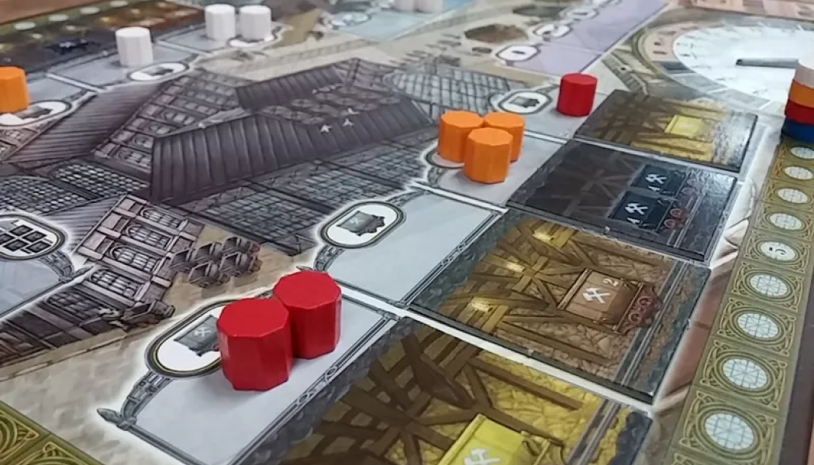
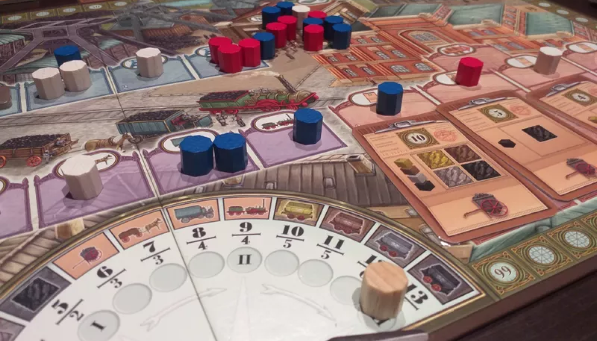

> ยูโรระดับเบา กลไก Worker Placement ที่ผู้เล่นรับบทเป็นเจ้าของเหมืองถ่านหินที่ต้องจัดการทรัพยากร พนักงาน และส่งมอบสินค้าตาม Order เพื่อทำแต้ม

### Setup

1. วางไทล์ปิดช่อง Action ตามจำนวนผู้เล่นที่แสดงในกระดาน
2. สับไทล์เหมือง แล้วจั่ววางในโซน Minecart factory
3. เข็มนาฬิกาไว้ที่ I และแท่งนับแต้มไว้ที่ตำแหน่งแรกสุดของการนับแต้ม
4. สับการ์ด Order แล้ววางไว้กลางกระดาน
   - 2 คน: 7 ใบ
   - 3 คน: 10 ใบ
   - 4 คน: 13 ใบ
5. การ์ด Order ที่เหลือให้มาวางในโซน Order แล้วจั่วการ์ดวางให้เต็ม
6. ผู้เล่นแต่ละคนวาง Victory Point marker วางไว้ที่แต้มบนกระดานหลัก
7. เงิน
   - 2 คน: 10 Marks
   - 3 คน: 9 Marks
   - 4 คน: 8 Marks
8. คนงาน
   - 2 คน: 18 อัน
   - 3 คน: 15 อัน
   - 4 คน: 13 อัน
9. First player marker สำหรับผู้เล่นคนแรก

### Playing

เกมนี้จะเล่นทั้งหมด 3 รอบใหญ่ `ในเกมจะเรียว่า "กะ (Shift)"` ในแต่ละเทิร์น ผู้เล่นจะวางคนงานตั้งแต่ 1 หรืออาจมากกว่านั้น ลง 1 ช่อง Action โดยรอบใหญ่จะจบต่อเมื่อคนงานของผู้เล่นทุกคนถูกใช้จนหมด เมื่อจบแต่ละรอบจะมีการนับคะแนน จากนั้นผู้เล่นคนไหนที่วางคนงานในโซน Minecart factory มากที่สุดจะได้เป็น ผู้เล่นคนแรกในรอบถัดไป แล้วผู้เล่นทุกคนเก็บคนงานแล้วเริ่มเล่นรอบใหม่

#### Action

ในเกมจะมี Action ทั้งหมด 5 อย่าง `ในเกมจะแบ่งเป็นโซน` โดยเงื่อนไขการวางคือเริ่มต้นวางคนงาน 1 อัน หากเป็นช่องที่ไม่วางจะต้องใช้คนงานเท่ากับจำนวนเดิมที่อยู่ในช่องนั้น +1 แล้วนำคนงานชุดเดิมไปไว้ที่ โรงอาหาร (Canteen)

**Minecart factory**

- จ่ายเงินตามจำนวนและประเภทของแร่
- ได้รับเหมืองไปวางไว้ที่บอร์ดตัวเอง โดยต้องวางให้ตรงประเภทแร่และดูว่ามีไฟหรือไม่มีไฟ (ซ้าย-ขวา)
- เมื่อเลือกเติมเหมืองให้เต็มทันที
- ช่องพิเศษจะจั่วการ์ดเหมืองมาดู 5 ใบ โดยจะซื้อ 1 หรือไม่ซื้อก็ได้ จากนั้นเลือกว่าจะเอาการ์ดที่ดูไว้บนกองหรือใต้กอง

---

**Mining**

- เลือกว่าจะใช้กี่ Action Point (AP)
  - เลื่อนลิฟท์ 1 ครั้ง (จะเลื่อนขึ้นลงกี่ชั้นก็ได้ แต่ถ้าหยุดคือจบ 1 ครั้ง) = 1 AP
  - ย้ายแร่ 1 ก้อน = 1 AP
  - เมื่อลิฟท์ถึงข้างบนสามารถใช้แร่สีอะไรก็ได้ 2 ก้อน แทนแร่สีอะไรก็ได้ 1 ก้อน เมื่อทำการย้ายแร่ (จากลิฟท์ไปโรงเก็บแร่ หรือจากลิฟท์ไป Order)

---

**Delivery**

- เงื่อนไข: จะต้องลงให้ตรงประเภทกับ Order ที่เสร็จและตรงกับประเภทรถขนส่งแล้วอย่างน้อย 1 ใบ
- ลงที่รถประเภทไหนก็จะได้ส่งแต่ประเภทนั้น

---

**Money**

- ลงช่องไหนได้เงินตามนั้น
- ช่องพิเศษจะไม่โดนเตะออก แต่จะได้เงินแค่ 1 Marks

---

**New Order**

- เลือก Order แล้วนำมาวางที่บอร์ดตัวเอง
- เมื่อเลือกแล้วเติม Order ให้เต็มทันที
- ช่องพิเศษทำเหมือนกับ Minecart factory

---

#### End Round (Shift)

นับคะแนนตามลำดับที่แสดงอยู่ส่วนเข็มนาฬิกา โดยรอบแรกจะนับแค่ 4 อย่าง รอบสองจะนับ 8 อย่าง และรอบสามนับ 12 อย่าง เมื่อนับแต่ละรอบเสร็จ ให้ดูว่าใครมีจำนวนคนงานในโซน Minecart factory มากสุดจะเป็นผู้เล่นคนแรกในรอบถัดไป เลื่อนเข็มไปกะที่สองและเลื่อน Scoring marker มาอันแรกใหม่อีกครั้ง

### End Game

1. 5 Marks = 1 แต้ม
2. แร่ทุกๆ 3 ก้อน = 1 แต้ม
3. Order ที่เหลืออยู่ = -1 แต้ม
4. ผลรวมของฝั่งซ้ายและขวา ถ้าไม่เท่ากัน จำนวนที่เกินมาจำนวนละ = -2 แต้ม\
   `(ต่างกัน 2 อัน = -4 แต้ม)`
