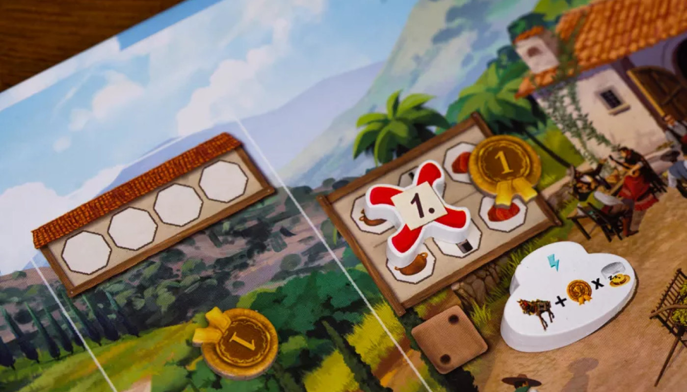
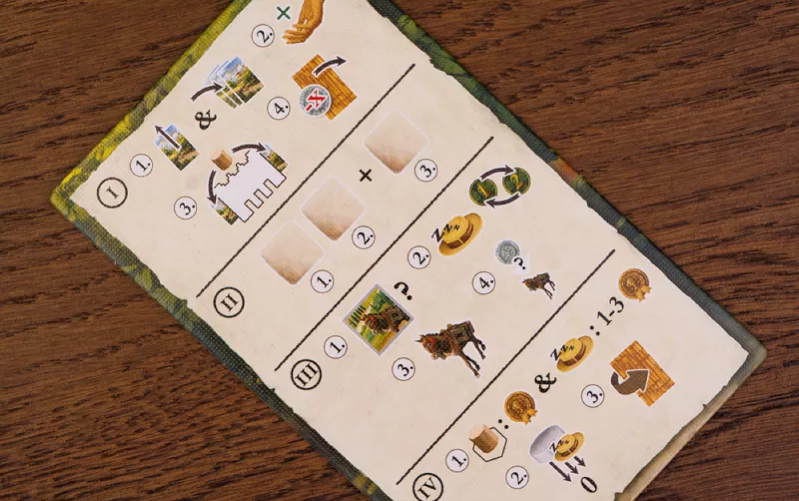
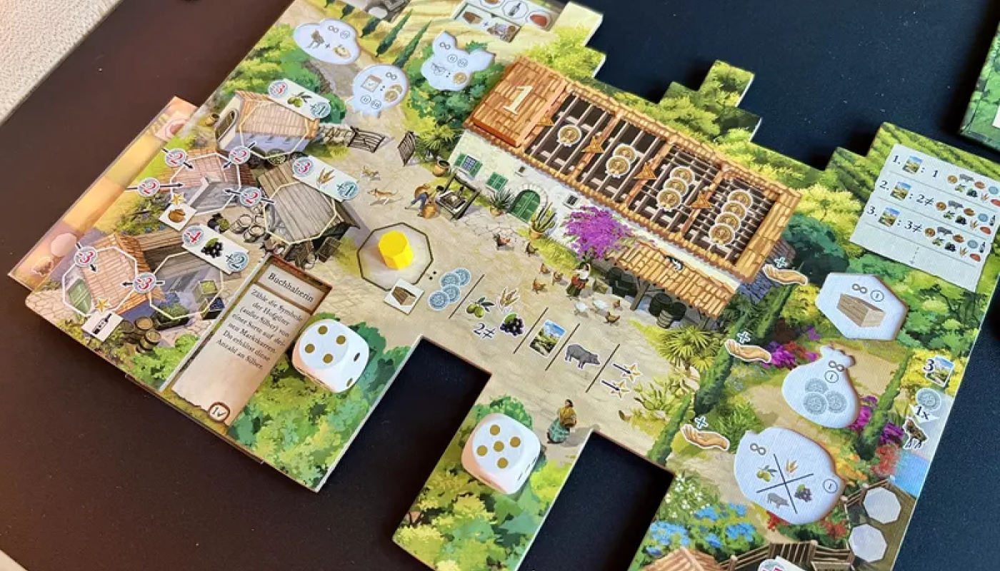

> ยูโรระดับกลาง กลไก Dice Drafting รับบทเป็นชาวไร่ส่งของขายในตลาด แต่จากชาวไร่อาจจะกลายเป็นมาเฟียคุมตลาดแทนได้!



### Setup

1. ผู้เล่นคนแรกนำ Maker มาไว้ตลาด แล้วคนถัดไปตามเข็มวางเลขถัดลงมา
   - 2 คน: 3/2
   - 3 คน: 4/3/2
   - 4 คน: 5/4/3/2
2. วาง Craft marker เท่ากับจำนวนผู้เล่นในแต่ละ Craft buildings
3. ทอยเต๋าเพื่อวาง Marker กากบาทปิด Craft buildings 3 อันแรก (สามารถปลดล็อกได้ในขั้นตอนการเล่น)
4. วางแต้ม 1 แต้มที่ Craft buildings แต่ละแห่ง และที่ Marker กากบาทแต่ละที่
5. สุ่มไทล์หลังคาแต่ละเลขตามจำนวนผู้เล่นแล้ววางคว่ำไว้ ยกเว้นเลข 1 ให้หงาย
6. แจกการ์ดให้คนละ 4 ใบ
7. เงินคนละ 1 บาท
8. แต้มคนละ 1 แต้ม
9. ไทล์ม้าคนละชุด (ม้า 1 - 4)
10. แต่ละคนนำ Marker 1 อันวางไว้ที่ช่องกล่องในบอร์ดผู้เล่น



### Playing

เราจะเล่นกันทั้งหมด 6 รอบ โดยดูรอบได้จากไทล์หลังคา เมื่อหลังคาเลข 6 ถูกเปิดจะถือว่าเป็นรอบสุดท้าย โดยแต่ละรอบจะประกอบด้วย Phase ย่อยอีก 4 Phase ดังนี้

```highlight
1. Farm Phase
2. Revenue Phase
3. Transportation Phase
4. Scoring Phase
```

#### Farm Phase

1. **เล่นการ์ด** 1 ใบ `(ในรอบแรกจะให้เล่น 2 ใบ)`
   - การ์ดจะสามารถใช้ได้ 4 แบบคือวาง บน ล่าง ซ้าย ขวา ซึ่งแต่ละแบบจะให้ความสามารถที่ต่างกันดังนี้
     - บน (**Market barrow**): จะเป็น Order ถ้าทำเสร็จจะได้ผลประโยชน์ตามที่ระบุ
     - ล่าง (**Helper**): ใช้ความสามารถการ์ด หากสัญลักษณ์ x1 คือใช้ได้ครั้งเดียวในแต่ละรอบ และบางใบจะมีบอกว่าใช้ได้ที่ Phase ไหน
     - ซ้าย (**Field**): เมื่อถึงช่วง Harvest ช่องที่ว่างให้นำ Maker มาวางไว้ แทนการผลิตวัตถุดับ (Olive, Grain, Grapes)
     - ขวา (**Farm extension**): เพิ่มการใช้ม้าได้ 1, ได้เงินเมื่อถึงช่วงรับ Income และถ้ามีหมู 2 ตัวจะได้หมูเพิ่ม 1 ตัวในช่วง Harvest
   - จากนั้นจั่วการ์ดตามจำนวนที่บอกด้านขวา (Farm extension) เริ่มต้นจะได้ 3 ใบ
2. **Income**
   - รับเงินตามจำนวนที่บอกด้านขวา (Farm extension) เริ่มต้นคือ 0 บาท
3. **Harvest**
   - นำ Maker มาวางไว้ที่ Field ที่ว่างอยู่
4. **ซื้อหลังคา**
   - ราคาเท่ากับจำนวนรอบ (เลขไทล์) ซื้อแล้วให้นำมาวางหงายไว้ที่หลังคาบอร์ดตัวเอง

---

#### Revenue Phase

1. ทอยเต๋าตามจำนวนผู้เล่น x2 แล้ว +1
2. นำเต๋าไปวางไว้ให้ตรงกับ Revenue ในบอร์ดกลาง
3. ผลัดกันหยิบเต๋าทีละลูกแล้วทำรับ Revenue ตามหน้าเต๋า 2 ครั้ง
4. ลูกที่เหลืออีกลูกทุกคนจะได้ทำเหมือนกัน




#### Transportation Phase

1. เลือกไทล์ม้าแล้วคว่ำไว้ที่มุมบนซ้ายของบอร์ดตัวเอง จากนั้นหงายพร้อมกัน
2. ผู้เล่นคนแรกจะขยับ Siesta track (0 - 3) จากนั้นเป็นคนอื่นตามลำดับ แล้วเรียงลำดับ Turn order ใหม่ โดยดูว่าใครอยู่บนสุด
3. ส่งม้าทำงานตามจำนวนม้าที่เลือก (1 - 4)
4. จ่ายเงิน 1 บาทต่อม้าที่อยู่ส่วน Farm extension ถ้าต้องการส่งของเพิ่ม

---

- ส่งของเข้า Market barrow
  - หากส่งของครบแล้วให้ดูผลประโยชน์ด้านล่าง ถ้าเป็นเลขให้นำไปวางที่ตลาดตามเลขที่ระบะ
  - หากเลขที่ตลาดเต็มสามารถเลือกดัน Maker อื่นออกไปแล้วเอาของตัวเองไปแทนได้
  - ได้รับแต้มตามเลข + จำนวนร้านค้าที่ถูกเตะออก (ร้านที่เลขน้อยกว่า)

---

- ส่งของเข้า Craft buildings ถ้าส่งครบแล้วให้วาง Maker 1 และรับ Craft Maker แล้วทำความสามารถทันที จากนั้นผลิกมาวางไว้ที่บอร์ดตัวเองเป็นความสามารถติดตัว
  - **Merchant House**: รับ 3 บาททันที `ได้รับ 3 บาทในช่วง Income`
  - **Wainwright**: ได้ม้าเพิ่ม 1 และรับแต้ม Siesta ทันที `ได้ม้าและ Siesta เพิ่ม 1 ทุกครั้ง`
  - **Deli**: รับกล่อง 1 อันทันที `กล่อง 1 อันในช่วง Income`
  - **Greengrocer**: รับของอะไรก็ได้ 1 อย่าง (ผักและหมู) `รับของอะไรก็ได้ช่วง Havest`
  - **Village Store**: รับ 2 แต้มทันที `2 แต้มทุกครั้งที่ส่ง Craft buildings เสร็จ`
  - **Butcher**: รับแต้มตามจำนวน Market barrow ทันที (0 - 3) `ทุกครั้งที่ทำ Market barrow เสร็จได้รับอีก 1 แต้ม`

---

#### Scoring Phase

1. ร้านที่อยู่ในตลาดร้านละ 1 แต้ม
2. แต้มที่แสดงใน Siesta track
3. ย้าย Siesta track ทุกคนมาล่างสุด
4. เปิดหลังคาเลขถัดไป

---

### End Game

1. ขายของในคลังสินค้าให้หมด (ขายได้ทุกอย่างยกเว้นของใน Field)
2. 5 บาท = 1 แต้ม
3. ใครแต้มมากสุดชนะ
