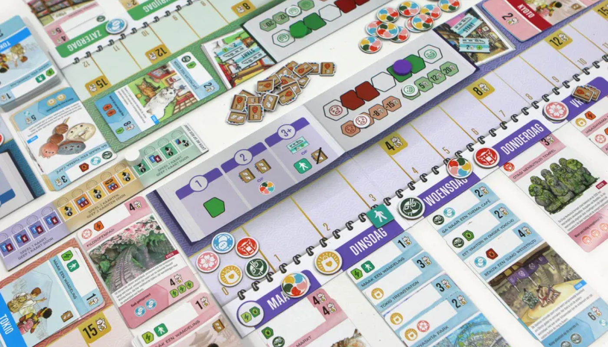
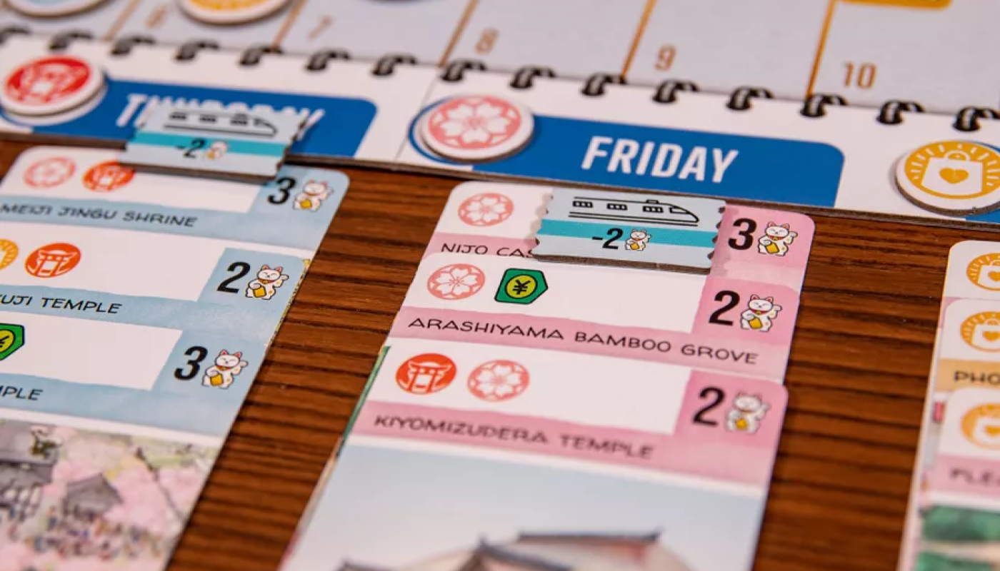
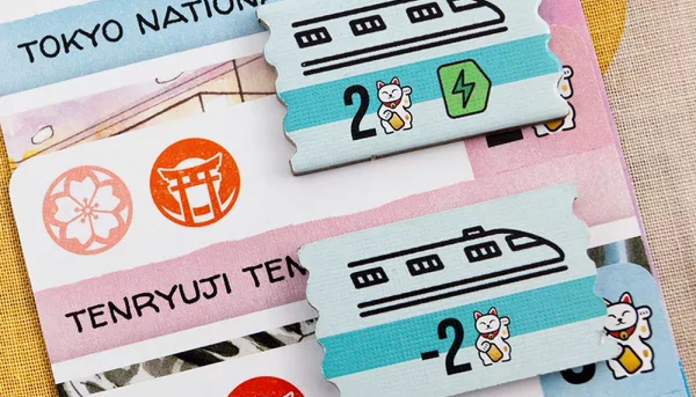

Let's Go! To Japan เป็นเกมเบาๆ น่ารัก ที่มีกลไก Set Collection ผสมกับการวางแผนเที่ยวญี่ปุ่นในธีมสดใส โดยผู้เล่นจะเล่นทั้งหมด 13 รอบเพื่อวางแผนตารางกิจกรรมตลอดสัปดาห์ของตัวเอง ทั้งโตเกียวและเกียวโต ผู้เล่นต้องคัดสรรการ์ดที่เหมาะสมเพื่อสร้างประสบการณ์ที่ดีที่สุด ขณะเดียวกันก็ต้องบริหารประสบการณ์อย่างสมดุล ใครเก็บคะแนนได้มากที่สุดจากการเดินทางจะเป็นผู้ชนะ!

แม้ระบบจะดูเรียบง่าย แต่จุดเด่นอยู่ที่การจัดการทรัพยากรและการตัดสินใจเลือกการ์ดในแต่ละรอบ

- การเลือกสถานที่ระหว่าง โตเกียว และ เกียวโต ต้องวางแผนล่วงหน้า เพราะการย้ายไปมาจะต้องใช้ตั๋วรถไฟ
- ในแต่ละวันวางการ์ดได้เพียง 3-4 ใบ โดยเมื่อครบ 3 ใบแล้วจะให้ เอฟเฟกต์ ต่างๆ ตามจำนวนเครื่องหมายประสบการณ์
  - เพิ่มแต้มความสุข
  - จั่วการ์ดเพิ่มผ่านหนังสือวิจัย
  - รับตั๋วรถไฟ
  - วางการ์ดแบบคว่ำเพื่อเพิ่มการ์ดใบที่สี่

> ความท้าทายเพิ่มขึ้นเมื่อการ์ดที่คนอื่นทิ้งมักไม่ตรงกับที่เราต้องการ ทำให้ต้องคิดว่า "จะเล่นหรือทิ้งดี?" จุดนี้เองที่เพิ่มความสนุกและการแก้ปัญหาเฉพาะหน้าในเกม

##### ความรู้สึกตอนเล่น

เกมนี้ให้ความรู้สึกผ่อนคลาย เหมาะสำหรับการเล่นเพลินๆ หรือเป็นเกมคั้นเวลาในช่วง 30 นาที แม้จะเป็นเกมที่งืมงำกับตัวเอง แต่ก็มีช่วงเล็กๆ ที่ผู้เล่นมีปฏิสัมพันธ์ เช่น การบ่นเรื่องการ์ดที่ถูกส่งต่อมาให้

---

##### เหมาะกับใคร

เกมนี้เหมาะสำหรับทุกเพศทุกวัย ไม่ว่าจะเป็นมือใหม่หรือคนที่มองหาเกมเบาๆ เล่นสนุกไปกับธีมญี่ปุ่นสดใส เล่นแล้วไม่เครียด แต่ยังได้คิดเล็กๆ น้อยๆ เพื่อวางแผนการเดินทางในฝันของตัวเอง
