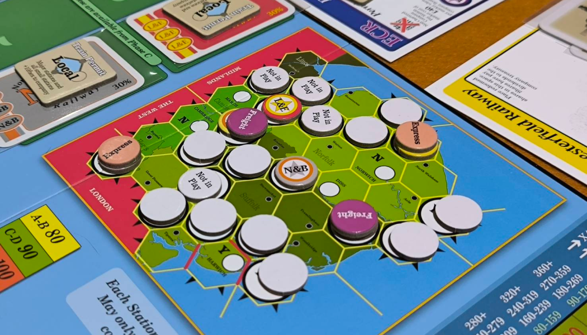
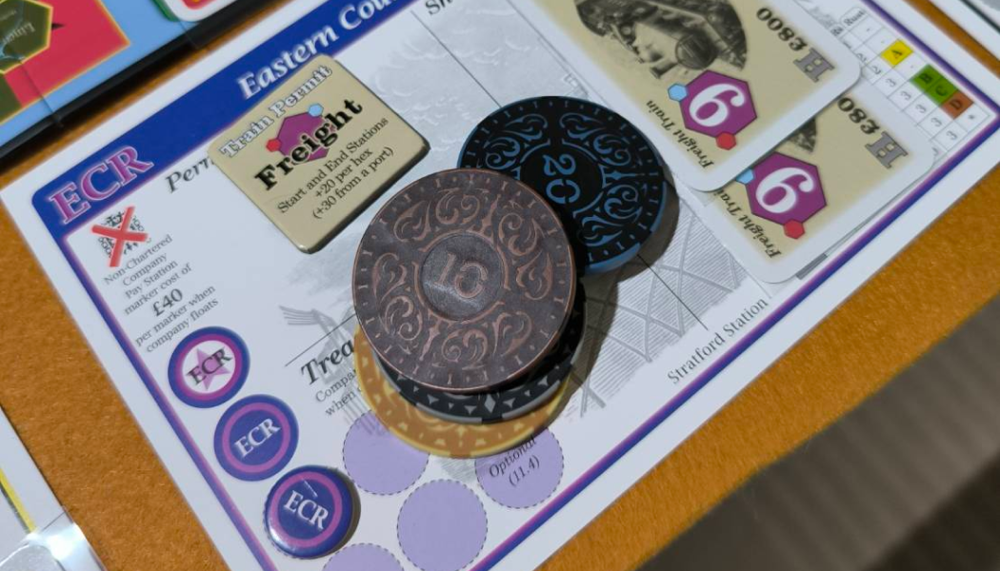

**1862: Railway Mania in the Eastern Counties** เป็นเกม 18xx ระดับหนักที่รวมความสนุกของการบริหารบริษัท การวางแผนการควบรวม และระบบใหม่ๆ เช่น Permit และ Parliament Round ซึ่งช่วยเพิ่มความหลากหลายและกลยุทธ์ให้กับเกม แม้จะตัดระบบ Private Company ออกไป แต่รับรองว่ายังอัดแน่นด้วยความท้าทายและการชิงไหวชิงพริบที่เข้มข้น

1862 นำกลไกจากภาคอื่นๆ มาใช้อย่าง Full Capitalization และ Incremental Capitalization พร้อมกับเพิ่มกลไกใหม่ๆ เช่น:

- **Parliament Round**: ประมูลเพื่อเปิดบริษัทแบบ Full Capitalization โดยประธานสามารถซื้อหุ้น 50% ได้ทันที แต่ถ้าทำไม่ได้ใน Stock Round จะถูกปรับเงิน (Par x2)

- **Permit**: เปลี่ยนวิธีการวิ่งรถไฟ โดยกำหนดประเภทการวิ่งที่แตกต่างกัน
  - **Freight**: วิ่งนับไทล์ โดยคิดเงินสถานีหัวท้าย และบวก Hex ละ 20 หากหัวหรือท้ายเป็น Port จะเป็น 30 แทน
  - **Express**: นับแต่สถานีใหญ่ วิ่งผ่านสถานีเล็กได้แต่ไม่คิดเงิน
  - **Local**: ไม่สามารถวิ่งออก Off-board หรือ Port ได้ แต่จะคิดเงินเมืองเล็กโดยไม่เสียจำนวนรถไฟ และได้เงินเข้าบริษัทตามจำนวนไทล์ที่วิ่งได้

ระบบนี้ช่วยเพิ่มความลึกในการตัดสินใจ เช่น การเลือกควบรวมบริษัท เพื่อให้วิ่งรถไฟหลายชนิดในบริษัทเดียว

อีกจุดโดดเด่นของ 1862 คือการควบรวมที่เพิ่มความซับซ้อนและความสนุกให้กับเกมได้ดี

- หุ้นจะถูกหารสอง และคำนวณมูลค่าใหม่ตามสูตร (ราคาหุ้นสูง/2) + ราคาหุ้นต่ำ
- ใครมี Option สามารถเลือกแลกหุ้น (จ่ายอีกครึ่งเพื่อหุ้นใหม่) หรือขายหุ้น (ได้ครึ่งราคา)

ระบบนี้บังคับให้ผู้เล่นต้องวางแผนล่วงหน้าว่าจะควบรวมเมื่อไร เพื่อให้มูลค่าหุ้นคุ้มค่าที่สุด

---

##### ความรู้สึกตอนเล่น

เป็น 18xx ที่เล่นแบบ Good company แต่การวางไทล์ตัดกันของภาคนี้ค่อนข้างเหี้ยมเลยทีเดียว ทำให้การวางไทล์และการเดินรถไฟต้องคิดล่วงหน้าอย่างรอบคอบ การควบรวมบริษัทก็เป็นทั้งโอกาสและความเสี่ยง โดยเฉพาะเมื่อสัดส่วนหุ้นอาจลดลง

---

##### เหมาะกับใคร

เหมาะสำหรับผู้ที่ชอบเกมยูโรหนักๆ และคุ้นเคยกับ 18xx พื้นฐาน เช่น 1846 หรือ 1889 แต่ถ้าเริ่มที่ภาคนี้เลยก็ทำได้ หากมีคนช่วยอธิบายกฎอย่างละเอียด เมื่อเล่นจบ คุณอาจมอง18xx ภาคพื้นฐานธรรมดาไปเลย

> 1862: Railway Mania in the Eastern Counties เป็นเกมที่ท้าทายทั้งในด้านกลยุทธ์และการบริหาร แม้ระบบจะซับซ้อน แต่ก็เต็มไปด้วยจุดเด่นที่ทำให้สนุกในทุกจำนวนผู้เล่น เหมาะกับผู้ที่มองหา 18xx ที่เข้มข้นและมีความลึกในทุกการตัดสินใจ
