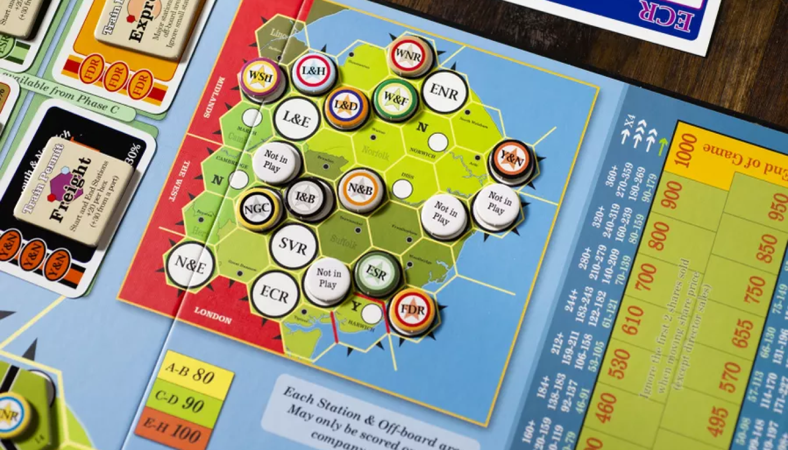

> 18xx ระดับหนักที่สนุกในทุกจำนวนผู้เล่น

ผู้เล่นรับบทเป็นนักลงทุนบริษัทรถไฟในประเทศอังกฤษ ซึ่งตามธีมเกมคือช่วงปี 1844 - 1862 ที่ประเทศอังกฤษเกิดการ "บูม" ของรถไฟเป็นอย่างมาก ทำให้เกิดบริษัทมากมายเป็นดอกเห็ด



จุดเด่งของอย่างแรกของ 1862 คือการเปิดบริษัท โดยมีด้วยกัน 2 ประเภทใหญ่ๆ คือ บริษัทที่ได้รับตราสารก่อตั้ง (Chartered company) และบริษัททั่วไป ซึ่งบริษัทแบบแรกจะได้จากการประมูลเพื่อเปิดเท่านั้น สิทธิ์พิเศษคือจะได้เงินเข้าบริษัททันที 10 เท่าของราคา Par หรือก็คือ Full capitalization และบริษัททั่วไปที่จะเปิดได้จากรอบ Stock Round (SR) เงินจะเข้าบริษัทตามราคา Par และจำนวนหุ้นที่ขายได้ หรือก็คือ Incremental capitalization

ใบหุ้นประธานบริษัทยังเริ่มต้นที่ 30% และยังสามารถถือได้ถึง 100% ได้เลยทีเดียว ทำให้แผนการเล่นค่อนข้างเป็นไปในทาง Good Company และจำนวนการถือหุ้นก็มีผลอย่างมากต่อการควบรวมบริษัทเช่นกัน

จุดเด่งอย่างที่สองคือ Permit แต่ละบริษัท ซึ่งจะทำให้แต่ละบริษัทวิ่งรถไฟต่างประเภทกัน

- **Freight**: วิ่งนับไทล์ โดยคิดเงินสถานีหัวท้าย และบวก Hex ละ 20 หากหัวหรือท้ายเป็น Port จะเป็น 30 แทน
- **Express**: นับแต่สถานีใหญ่ วิ่งผ่านสถานีเล็กได้แต่ไม่คิดเงิน
- **Local**: ไม่สามารถวิ่งออก Off-board หรือ Port ได้ แต่จะคิดเงินเมืองเล็กโดยไม่เสียจำนวนรถไฟ และได้เงินเข้าบริษัทตามจำนวนไทล์ที่วิ่งได้


นอกจากนี้รถไฟยังบังคับให้วิ่งผ่านสถานีหลักอย่างน้อย 1 ขบวน และสามารถวิ่งทับรางได้ แต่จะไม่ถูกคิดเงิน ให้คิดภาพว่าเป็นรถไฟหลากหลายประเภทเชื่อมถึงกัน BTS - MRT

และอีกจุดเด่นคือการควบรวมบริษัท ซึ่งค่อนข้างจุกจิกไม่น้อย เนื่องจากต้องนำจำนวนหุ้นทั้งหมดของทั้งสองบริษัทที่จะควบรวมมาบวกกันแล้วหารสอง เพื่อแลกเป็นหุ้นบริษัทที่อยู่รอด แล้วจากนั้นคิดราคาหุ้นใหม่ โดยปกติคือ `(ราคาบริษัทสูง / 2 ) + ราคาบริษัทต่ำ` แต่ถ้าบริษัทไหนไม่มีรถไฟจะโดนหารครึ่งก่อนค่อยนำมาบวกกันอีกที

ทีนี้ตอนหารจำนวนหุ้น หากมีเศษก็ให้เอาคว่ำไว้เพื่อบอกว่ามีหุ้นที่เป็น Option นะ รอการซื้อขายอยู่ ซึ่งเมื่อทุกคนแปลงจำนวนหุ้นเรียบร้อยแล้วก็ค่อยมาคิดต่อว่าจะแลกหุ้น 1 Option เป็นหุ้นบริษัทที่รอด 1 หุ้น (10%) โดยจ่ายส่วนต่างอีกครึ่งเพิ่ม หรือขายหุ้น ก็จะได้ราคาหุ้นหารครึ่งแทน เช่นกันกับกรณีที่หุ้นบริษัทหมดก็บังคับขายอย่างเดียว

นอกจากนี้ยังมีรายละเอียดยิบย้อยอย่าง ถ้าบริษัทไม่สามารถซื้อรถไฟได้ จะบังคับให้ทุกคนคือหุ้นครึ่งหนึ่งเข้าธนาคาร ลักษณะเดียวกับการควบรวม ถ้ามีเศษก็ทำ Option จากนั้นบริษัทจะได้เงินเข้าทันที 10 เท่าของราคา Par ไปซื้อรถไฟ

หรือถ้ามีการเปลี่ยนแปลงจำนวนหุ้นตอนควบรวมหรือซื้อรถไฟไม่ได้ ทำให้มีสิทธิ์เป็นประธานเท่ากัน หรือ ไม่มีใครที่สามารถเป็นประธานได้เลย (มีแต่คนถือ 20%) จะมีผู้พิทักษ์ทรัพย์มาเป็นประธานแทนจนกว่าจะมีคนที่เป็นประธานใหม่ได้อีกครั้ง ซึ่งจะไม่สามารถวางไทล์หรือวางสถานีใหม่ได้ วิ่งรถไฟตามปกติแต่บังคับไม่จ่ายปันผล หาก OR นี้ยังไม่มีประธาน ไม่มีรถไฟ หรือไม่สามารถซื้อรถไฟได้ บริษัทจะถูกปิดทันที

---

##### End game

> ผู้ชนะคือคนที่มีเงินมากที่สุดจากมูลค่าหุ้นและเงินสดของตนเอง (ไม่นับของบริษัท)

---

#### Tips

```Highlight
ภาคนี้มี Solo ด้วยนะ น่าจะเป็น 18 ภาคเดียวที่มีตอนนี้ กฏมีใสไว้ในกล่องเลย
```
