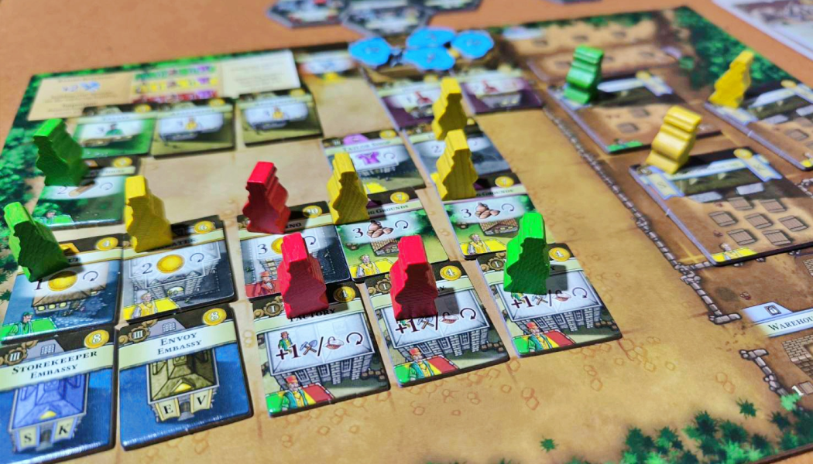
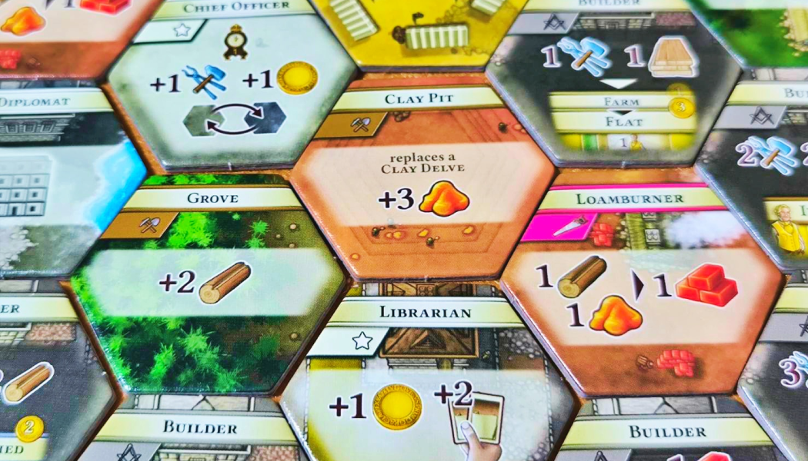

> เราจะมาเป็นผู้นำของหมู่บ้าน ให้หมู่บ้านเจริญรุ่งเรืองที่สุด ผ่านการสร้างสิ่งปลูกสร้างที่อยู่อาศัยและที่ทำงาน โดยจะเล่นกันทั้งหมด 4 ยุค ในแต่ละยุคมี 5 ปี แต่ละปีมี 2 ฤดู และในแต่ฤดูมี 3 Actions รวมแล้วทั้งเกมเรามีทั้งหมด 120 Actions! จบเกมใครมีแต้มเยอะสุดก็ชนะ (เจริญที่สุด)

### Playing

เป้าหมายของเกมคือการทำแต้มให้ได้มากที่สุดภายใน 4 ยุค จากการเล่น Actions ต่างๆ โดยแต้มส่วนใหญ่จะมาจากการสร้างสิ่งปลูกสร้าง แต่การสร้างสิ่งปลูกสร้างก็ต้องจ่ายสินค้าอุตสาหกรรม (ในเกมจะมีสองประเภทใหญ่ๆ คือ อุตสาหกรรมและของใช้สำหรับคนงาน) ซึ่งสินค้าอุตสาหกรรมสามารถหาได้จากการทำ Actions ในแผนที่ หรือ ผลผลิตจากที่ทำงานที่จะได้ในทุกๆ ปี และแน่นอนว่าเมื่อมีที่ทำงานก็ต้องการคนงาน คนงานก็จะหาได้จากการสร้างหรืออัพเกรดที่อยู่อาศัยเพิ่ม

หมู่บ้านของเราจะขยายใหญ่ขึ้น จากชาวไร่ 2 คน จนมีโรงหนัง ร้านเสื้อผ้า คาสิโน เกมนี้จึงเป็นการสร้างแบบค่อยๆ สร้างจากฐานขึ้นไป นอกจากหมู่บ้านของเราที่ใหญ่ขึ้น เมืองที่เป็นแผนที่กลางก็จะใหญ่ขึ้นเช่นกัน โดยแผนที่จะประกอบไปด้วยไทล์ Action ที่แตกต่างกันใหญ่ๆ คือ

1. เกี่ยวกับสินค้า (เอาไปเลย กับ แลกเปลี่ยน)
2. สร้างอาคารชนิดนั้นๆ
3. จั่วการ์ดพิเศษ / เล่นการ์ด
4. การสร้างสถานทูต (สถานทูตจะทำให้เรามีความสามารถติดตัวมากขึ้น)

ตอนแรกแผนที่จะมีขนาดแค่ 12 ไทล์ แต่ในยุคต่อๆ ไป แผนที่ก็จะขยายตัวมากขึ้น การมีแค่ 3 Actions คงไม่พอกับ Actions มากมายในแผนที่ การวางแผนการเดินจึงเป็นสิ่งสำคัญมาก

การวางแผนการเก็บสินค้าก็เป็นอีกสิ่งที่สำคัญเช่นกัน เพราะคลังเก็บของที่จำกัด และบังคับให้จ่ายสินค้าจากคลังเท่านั้นเมื่อทำ Actions ในแผนที่ แต่เกมก็ไม่ได้ใจร้ายขนาดนั้น ผู้เล่นสามารถสลับไปมาระหว่างคลังกับโรงเก็บของได้ (ยกเว้นสลับไปมากับที่ทำงาน ในเกมเรียก "Buffer")

#### Experience

เมื่อมองภาพรวมคร่าวๆ เกมทำแค่เดิน 3 Actions วนไปเรื่อยๆ ตลอดทั้งเกมเราจะวุ่นอยู่กับการแปลงสินค้าไปมา แต่เมื่อเล่นจริง 3 ชั่วโมง++ เพราะการจะก้าวไปทำแต่ละ Actions ต้องคิดแล้วคิดอีก พอหมู่บ้านเราขยายขึ้น คนเริ่มต้องการค่าใช้จ่ายมากขึ้น เราก็ต้องสร้างโรงงานผลิตอาหารไม่ก็เสื้อผ้า ไม่งั้นก็ต้องเดินไปเอาจากในแผนที่ ระหว่างนั้นก็อาจจะมีของบางอย่างระหว่างทาง บางทีแวะไปเรื่อยจนลืมไปว่าตอนแรกจะทำอะไร ฮาๆ และนี่คือประสบการณ์การเล่น 2 คน ถ้า 3 คนอาจจะคิดแล้วอีกว่าจะกางดีมั้ย แต่ถ้า 4 คนคือไม่กางแน่นอน รอไม่ไหว

การเล่นคนเดียวจะเป็นการเล่นแบบทำคะแนนให้ได้สูงที่สุด ไม่ได้มีบอทมาบล็อค Action อะไร ก็ถือว่าเป็นการเล่นเพลินๆ ฟิลเหมือนเรากำลังก่อร่างสร้างหมู่บ้านไปเรื่อยๆ

### Note

เกมนี้ควรมี Insert อย่างยิ่ง เพราะ Components เยอะมากๆๆๆ ที่ใช้อยู่จะเป็นกล่องแบ่งช่อง 30 ช่อง 2 อัน หาได้จากร้านขายของญี่ปุ่น 60 บาท (พวก Komonoya)
